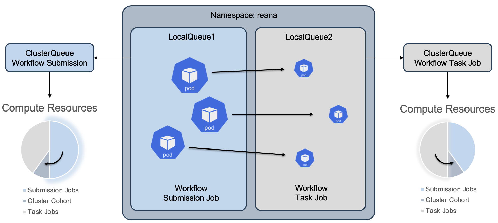

# Experiment Architecture Configuration

This folder contains all the configuration files for the architecture used in the experiment. The architecture is designed to evaluate the performance and scalability of workflows within the Kueue scheduler. Below are the key configuration files and components of the architecture:

## Cluster Queue Configuration

**File:** cluster-queue.yaml

**Description:** This configuration file defines the ClusterQueue named `reana-summer-cluster` for managing a pool of resources, including CPU and memory. It specifies the cohort as reana-summer-cluster and covers the resources `["cpu", "memory"]`.

## ResourceFlavor Configuration

**File:** resource-flavor.yaml
**Description:** This configuration file defines a ResourceFlavor named benchmark for all homogeneous resources within the cluster. This simplifies resource management by labeling nodes as benchmark to make it more manageable when assigning resource flavors to the nodes.

## Cluster Local Queues Configuration

**File:** cluster-local-queues.yaml
**Description:** This configuration file defines two LocalQueues: `reana-wf-cq` and `reana-job-cq`, each pointing to their respective ClusterQueue for workload management. These local queues facilitate the submission and execution of workloads within their designated namespaces.

## Node Labeling Script

**File:** labels.sh
**Description:** This shell script is used to label nodes within the Kubernetes cluster. It applies the benchmark label to nodes in a loop, making it easy to assign resource flavors to the labeled nodes. Proper node labeling is crucial for resource allocation and management.

## Architecture Diagram

For a visual representation of the experiment architecture, please refer to the following image:

## Conclusion

The configuration files provided in this folder define the fundamental components of the experiment architecture. These configurations are essential for orchestrating and managing workflows within the Kueue scheduler, evaluating their performance, and optimizing resource utilization.

Please review and modify these configuration files as needed for your specific experiment requirements. The architecture is designed to provide flexibility and scalability for conducting experiments and gathering valuable insights into workflow execution and resource management.