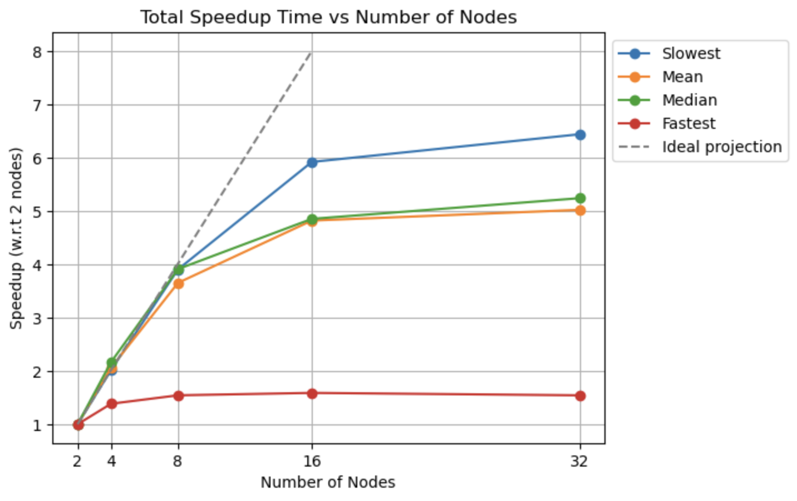
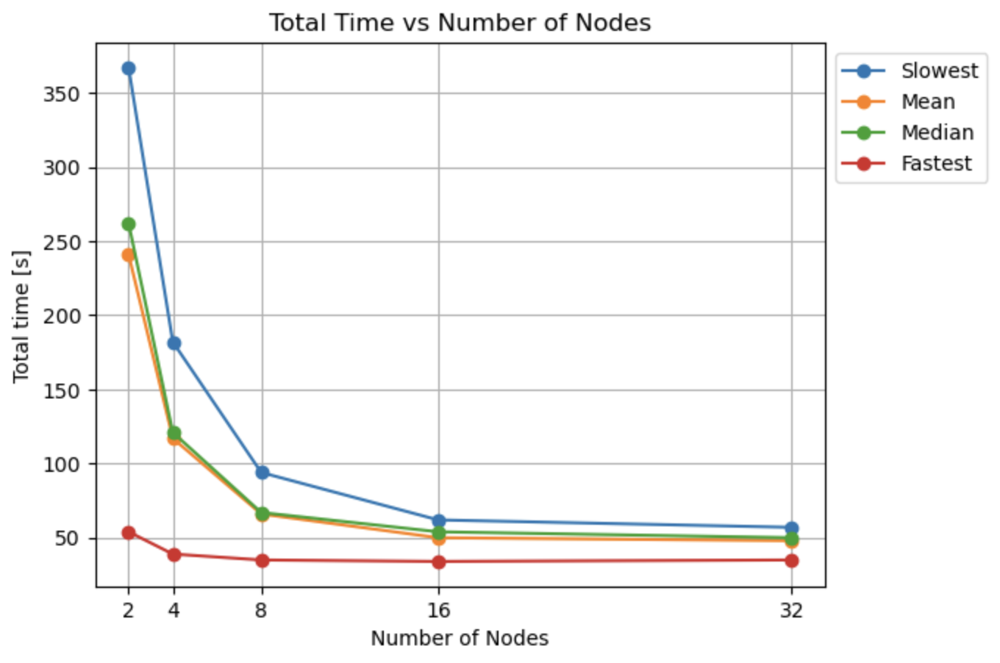
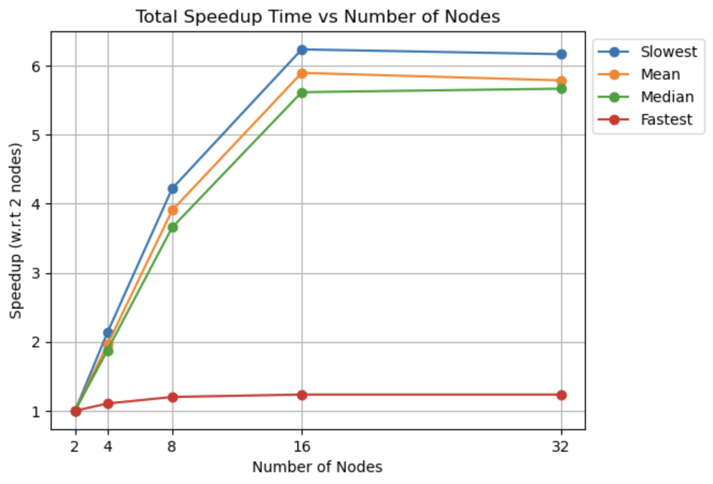
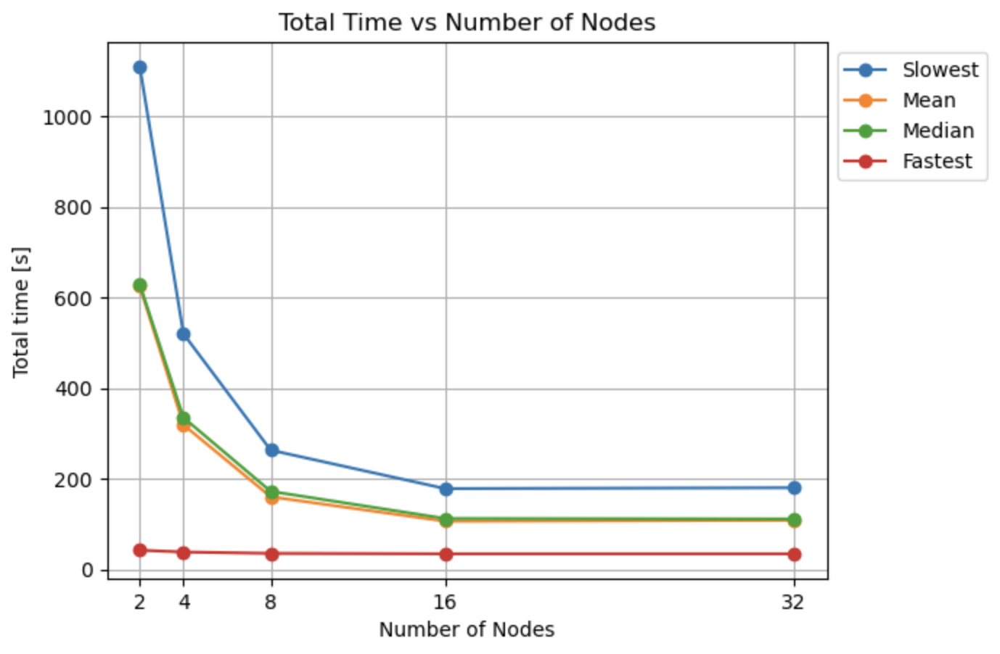

# Workflow Performance Experiments

This folder contains the results of workflow performance experiments conducted using Kueue. The experiments focused on evaluating the speedup and total time of execution for two sets of workflows: one with 128 workflows and the other with 384 workflows. Each set of experiments was conducted with varying numbers of nodes to understand the impact of parallelization on workflow execution.

## Experiment Details

### 128 Workflows
- Speedup Graph vs. Number of Nodes

- Total Time vs. Number of Nodes

### 384 Workflows
- Speedup Graph vs. Number of Nodes

- Total Time vs. Number of Nodes

## Experiment Results

### Speedup Graph vs. Number of Nodes

Both sets of experiments include speedup graphs that illustrate the relationship between the number of nodes and the speedup achieved in comparison to using 2 nodes as a reference. The speedup graph provides insights into how effectively the system utilizes additional nodes to accelerate workflow execution.

### Total Time vs. Number of Nodes

Additionally, the experiments present graphs depicting the total time of execution versus the number of nodes used. These graphs help us understand the impact of node scalability on the overall execution time of workflows.

## Observations
In the analysis of the experimental results, it's noteworthy that we didn't observe a significant increase in speedup beyond the introduction of 16 nodes for both 128 and 384 workflows in respect to 2 nodes. This phenomenon can be attributed to several factors. Firstly, as the number of nodes increases, the concept of "diminishing returns" in parallel computing comes into play. Beyond a certain point, the marginal difference between using 16 nodes and 32 nodes suggests that other factors, such as resource constraints or overhead, may start to impact the speedup gains more prominently than the benefits of additional nodes. Secondly, the specific nature of the computational workload also plays a crucial role. If the tasks within the workflows exhibit limited parallelizability or dependencies that cannot be easily parallelized, the system's ability to harness additional nodes effectively diminishes.

These combined factors explain the observed behaviors in speedup beyond 16 nodes, highlighting the importance of optimizing workload parallelization and resource allocation for achieving optimal performance in parallel computing environments.

## Experiment Files

This folder contains two IPython Notebook files, each corresponding to the results of experiments conducted with 128 and 384 workflows. The results, graphs, and observations are documented within these files for further analysis.

- 128WF_Results.ipynb
- 384WF_Results.ipynb

Feel free to explore the detailed experiment results and analysis in the respective notebook files to gain insights into the performance of workflows under different node configurations.

## Conclusion

The experiments conducted in this study provide valuable insights into the performance and scalability of workflows in a parallel computing environment. Understanding the limitations of speedup beyond a certain node count and the impact of workload characteristics on parallel execution is crucial for optimizing workflow performance. The results presented here contribute to the ongoing efforts to enhance the efficiency and resource utilization of workflow execution using Kueue.

For detailed experiment-specific information and graphs, refer to the respective notebook files.